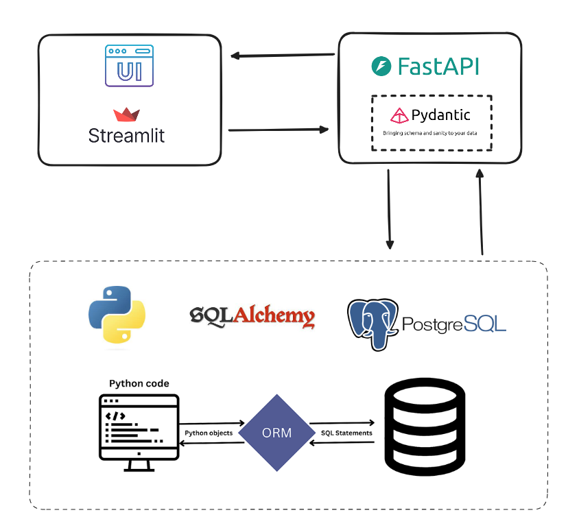

# Rental Properties CRUD Catalog with SQLAlchemy, FastAPI, Streamlit and AWS Deploy

This project consists of a web application to interact with a catalog of rental properties stored in a PostgreSQL database. Users can perform all CRUD operations, which include: 
- Create a new item in Database. 
- Accessing all items in the catalog or a specific one by passing the correesponding ID. 
- Updating a specific item in catalog by passing the corresponding ID. 
- Delete a specific item in catalog by passing the corresponding ID.


## How it Works





### Project Folder Structure
```
├── README.md
├── backend
│   ├── Dockerfile
│   ├── __init__.py
│   ├── crud.py
│   ├── database.py
│   ├── main.py
│   ├── models.py
│   ├── requirements.txt
│   ├── router.py
│   └── schemas.py
├── docker-compose.yaml
├── frontend
│   ├── Dockerfile
│   ├── app.py
│   └── requirements.txt
├── poetry.lock
└── pyproject.toml
```