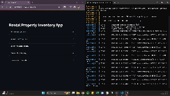
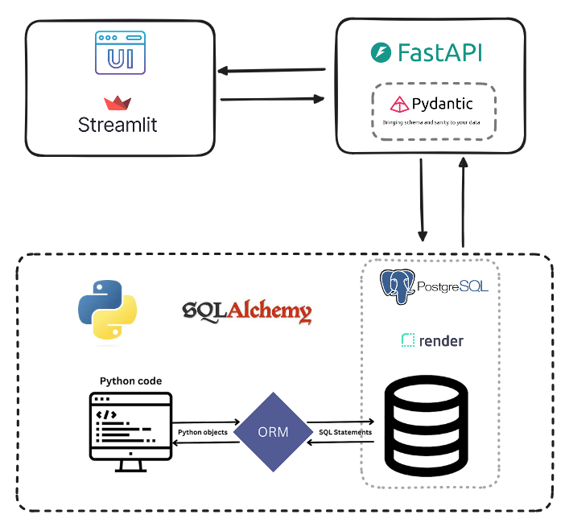

# Rental Properties CRUD Catalog with SQLAlchemy, FastAPI, Streamlit and AWS Deploy

This project consists of a web application for interacting with a catalog of rental properties stored in a PostgreSQL database. Users can perform all CRUD operations, which include: 

- Create a new item in the Database. 
- Accessing all items in the catalog or a specific one by passing the correesponding ID. 
- Updating a specific item in catalog by passing the corresponding ID. 
- Delete a specific item in catalog by passing the corresponding ID.

It is built in a way where three services communicate with each other separately: the database, backend, and frontend. Docker Compose is used to orchestrate the containers, allowing the frontend to communicate with the backend through the API, with each service running in independent containers.

The backend was built using [FastAPI](https://fastapi.tiangolo.com/) with asynchronous routes, and the frontend was built using [Streamlit](https://streamlit.io/).

Below is a demonstration of the project deployed on EC2 AWS Cloud. The console on the right shows the API methods and their responses.



Due to cost considerations, the EC2 instance was terminated, and the project is no longer available online, although you can run it locally by following the steps in [how to run this project](##How-to-run-this-project-locally-with-Docker).

## Table of Contents
- [How it Works](#how-it-works)
  - [Project Folder Structure](#project-folder-structure)
- [How to Run This Project](#how-to-run-this-project)

## How it Works

The table below shows the 5 catalog fields used in the application. For House Type identification, the convention commonly used in Europe was employed, where T0 represents a house with no bedrooms, T1 represents a house with one bedroom, and so on.

| Column Name | Python Type Hint                     |
|-------------|--------------------------------------|
| Description | ``str``                              |
| House Type  | ``str in ['T0', 'T1', ..., 'T6+' ]`` |
| Price (€)   | ``float``                            |
| Area (m²)   | ``float``                            |
| Location    | ``str``                              |


As shown in the image below, the frontend was created using Streamlit, where users can perform CRUD operations.

In each of these operations, the frontend sends a request to the API created using FastAPI. The API is responsible for communicating with the backend and sending a response back to the frontend to display the result of the CRUD operation. In the first layer, Pydantic is used to validate all the inputs, ensuring that the schema the user is trying to send matches the database table schema. If it doesn't match, an error message is displayed to the user.

After [Pydantic](https://docs.pydantic.dev/latest/) validation is completed, [SQLAlchemy](https://www.sqlalchemy.org/) is used to communicate with PostgreSQL and perform one of the CRUD operations in the database.



[Alembic](https://alembic.sqlalchemy.org/en/latest/) was also used to perform database migrations, and [Pytest](https://docs.pytest.org/en/stable/) was used to perform some basic tests on asynchronous backend routes.

### Project Folder Structure
```
.
├── README.md
├── alembic.ini
├── backend
│   ├── Dockerfile
│   ├── __init__.py
│   ├── alembic
│   │   ├── README
│   │   ├── env.py
│   │   ├── script.py.mako
│   │   └── versions
│   │       └── d369125a327d_properties_table.py
│   ├── crud.py
│   ├── database.py
│   ├── entrypoint.sh
│   ├── main.py
│   ├── model.py
│   ├── router.py
│   ├── schema.py
│   └── settings.py
├── docker-compose.yaml
├── frontend
│   ├── Dockerfile
│   ├── __init__.py
│   ├── app.py
│   └── response.py
├── media
│   ├── demo.gif
│   └── diag.png
├── poetry.lock
├── pyproject.toml
└── tests
    ├── conftest.py
    └── test_router.py
```

## How to run this project

As mentioned before, this project was built in a way that the frontend and backend run in different Docker containers. To run it locally, I used Docker CLI in a `bash` terminal.

- [Install Docker](https://docs.docker.com/engine/install/)
- [Overview of installing Docker Compose](https://docs.docker.com/compose/install/)

The steps below will automatically create a local PostgreSQL instance, connect to it, and create the tables in the database.

To connect to a different PostgreSQL instance (not the one created automatically), it is necessary to create a .env file and provide the following URL to connect to it:

```
DATABSE_URL=postgresql+asyncpg://<db_username>:<db_secret>@<db_host>:<db_port>/<db_name>
```

To run it locally:

1 - Clone the repository locally:
```bash
git clone https://github.com/lealre/crud-rental-properties.git
```

2 - Access the project folder:
```bash
cd crud-rental-properties
```

3 - Build the Docker image:
```bash
docker compose build
```

4 - Run the Docker container:
```bash
docker compose up
```

5 - Access your localhost in port 8501:

http://localhost:8501/

After these steps you should be able to access the app and perform all CRUD operations in your database.

Note: Make sure `.env` file is included in `.gitignore`.

---------------------------
This is a modified version of Project 02 from the [Python Bootcamp for Data engineering](https://github.com/lealre/python-bootcamp-de).
